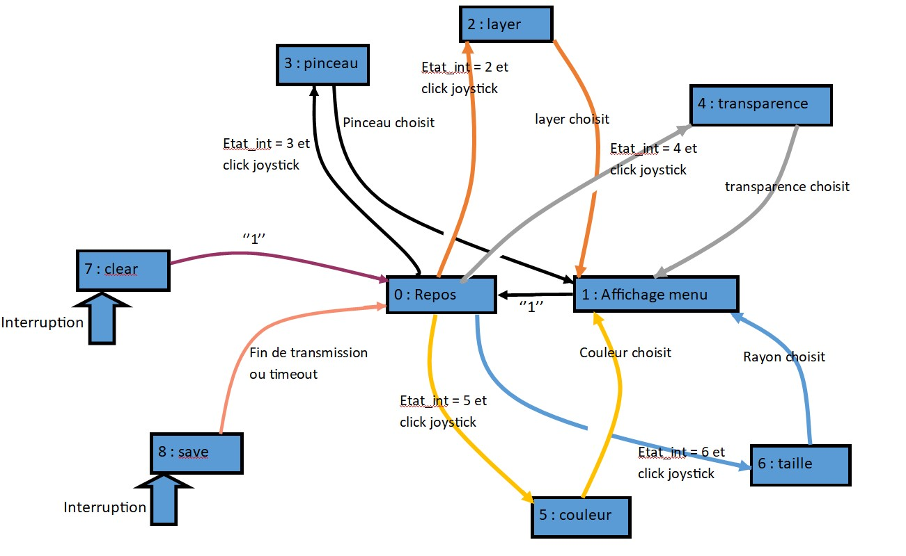

# Fonctionnement du projet

## Interaction entre tâches
Le Diagramme d'interaction entre tâches est le suivant :

## Les états possibles

+ L'état par défaut, est celui par défaut comme son nom l'indique, il ne fait rien pour ne pas ralentir le programme.
+ L'état d'actualisation du menu affiche le menu du bas ainsi que les indicateurs à droite, après avoir modifié un paramètre on vas dans cet état pour ensuite retourner dans l'état par défaut.
+ Les état lié au menu du bas, layer, pinceau, transparence, couleur, rayon. Ces état on tous la même structure : on a une variable sous menu valant 0 ou 1 qui permet de savoir si le sous menu a été affiché pour ne pas afficher le contenu du sous_menu plusieurs fois. On a l'architecture suivante :

+ L'état de clear de la zone de dessin se fait sur interruption.
+ L'état de sauvegarde est également sur interruption.

Les relations entre les différents état sont décrite sur le diagramme d'état suivant : 

## Barre de sélection

La gestion d'un barre de sélection continu se fait en plusieurs étapes :

+ Affichage de la barre(dans notre cas souvent un dégradé de couleur).
+ On attend un appuie tactile sur la zone de la barre puis on boucle tant que le doigt est maintenu.
	+ On lit la coordonné x sur l'écran à laquel on retire l'abcisse x du début de la barre de sélection, ce qui nous donne la distance entre le début de la barre et le doigt. On peut changer des paramètres à partir de ça.

Ainsi l'utilisateur peut voir en direct l'effet de sa sélection en direct et simplement déplacer son doigt pour changer au lieu de devoir refaire tout du début si il clique trop à droite ou à gauche.

Par exemple pour le cas 4 qui correspond à la sélection de la transparence on a :

+ Affichage de la barre dégradé de transparence et d'un petit texte

		BSP_LCD_SelectLayer(1);
		BSP_LCD_SetTextColor(LCD_COLOR_WHITE);
		BSP_LCD_FillRect(0, 251, 480, 21);
		BSP_LCD_SetTextColor(LCD_COLOR_RED);
		BSP_LCD_DisplayStringAt(0, 252,(uint8_t*) text_alpha, LEFT_MODE);
		for(uint32_t i = 0;i<256; i++)
		{
			for(char j = 0; j<18; j++)
			{
				BSP_LCD_DrawPixel(200+i, 252+j, i << 24);
			}
		}
	
+ On boucle tant que l'on appuie dans la zone de la barre

		BSP_TS_GetState(&TS_State);
		while(TS_State.touchDetected)
		{
			if((TS_State.touchX[0]>200) && (TS_State.touchY[0] > 272-haut_menu) && (TS_State.touchX[0]<455))
			{
				//
				// Action à faire en fonction de la position du doigt
				//
			}
			sous_menu = 0;
			BSP_TS_GetState(&TS_State);
		}

+ Changement de la transparence en fonction de la position du doigt.

		couleur &= 0x00FFFFFF; //on enlève l'ancienne transparence
		couleur |= ((TS_State.touchX[0]-200)<<24);
		if(myMutexLCDHandle != NULL)
		{
			if(xSemaphoreTake(myMutexLCDHandle,100) == pdTRUE)
			{
				BSP_LCD_SetTextColor(couleur & 0xFF000000);
				BSP_LCD_FillCircle(480-taille_menu/2, 5*taille_menu/2, taille_menu/2-5);
				xSemaphoreGive(myMutexLCDHandle);
			}
		}

## Sélection de la couleur

La sélection de la couleur pourrait se faire trivialement en choisissant R, V, puis B. Cependant cette méthode est pratique d'un poit du vu informatique, mais il est difficile de choisir une courleur de cette manière pour un humain. Ainsi le système de sélection de couleur choisit est le système TSB (teinte, saturation, brillance) dont une explication détaillé est disponible dans [l'article wikipedia associé](https://fr.wikipedia.org/wiki/Teinte_saturation_luminosité).

Ainsi, les choix de l'utilisateur nous donne une valeur de teinte (variable *ton*) entre 0° et 360°, représentant le spectre des couleurs visible. Une valeur de luminosité (variable *lum*) et de saturation (variable *sat*) entre 0 et 1. A partir de ses valeurs on utilise la fonction **FindCouleur** qui utilise la méthode de passage TSB vers RVB de l'article wikipedia pour obtenir un format de couleur lisible pour l'ordinateur.

## Peindre

Pour peindre dans la zone de dessin on appel la fonction **LCD_PAINT_BRUSH** qui dessine la forme du pinceau souhaité à une position (x, y) avec un rayon rad.
 
	void LCD_PAINTBRUSH(uint16_t x, uint16_t y,uint16_t rad)
	{
		uint32_t color;
		switch(brush)
		{
		case 0 :
			BSP_LCD_FillCircle(x, y, rad);
			break;
		case 1 :
			BSP_LCD_FillRect(0, 0, 425, 246);
			break;
		case 2 :
			for(int i = 1; i<=Radius; i++)
			{
				color =((255-((i-1)*255/radius))<<24);
				BSP_LCD_SetTextColor(color);
				BSP_LCD_DrawCircle(x, y, i);
			}
			break;
		case 3 :
			BSP_LCD_FillEllipse(x, y, radius, radius/2);
			break;
		case 4 :
			BSP_LCD_FillEllipse(x, y, radius/2, radius);
			break;
		case 5 :
			BSP_LCD_SetTextColor(LCD_COLOR_WHITE);
			BSP_LCD_FillRect(x-radius, y-radius, 2*radius, 2*radius);
			break;
		}
	}

