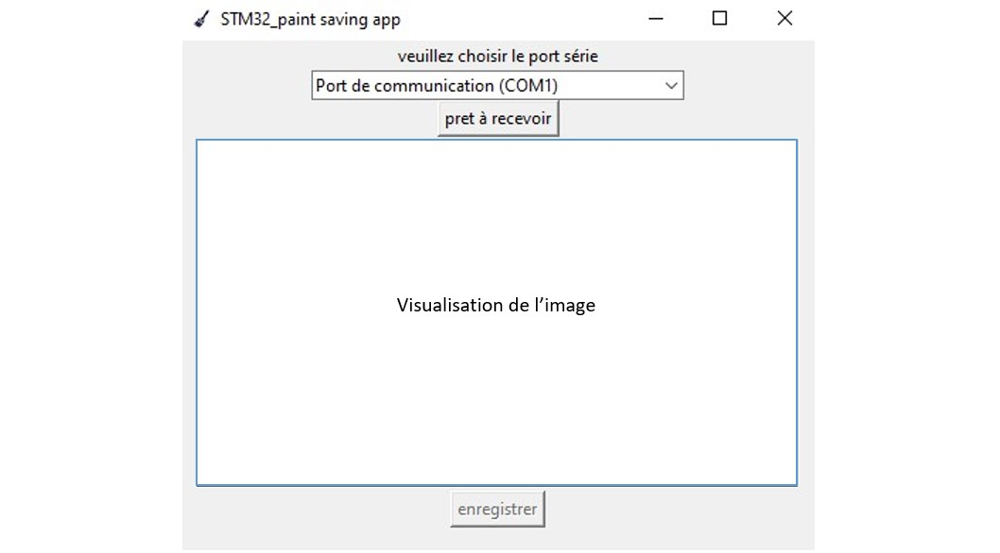

# Guide d'utilisation partie sauvegarde

## Set Up
Pour pouvoir sauvegarder votre dessin, la carte doit être lié en USB à l'ordinateur et être ne train d'éxecuter le programme de la partie dessin. Ensuite, lancer le code python, une fenêtre de la forme suivante devrai s'ouvrir.

##Réceptionner le dessin de la carte
Une fois la fenêtre ouverte et la carte connecté, sélectionner le port COM auquel la carte est branchée. Pour réceptionner le dessin suivre les étapes suivantes :

+ Cliquer sur le bouton prêt à recevoir, un message s'affiche en attendant le début de la transmission
+ Pour débuter la transmission cliquer sur le bouton BP1 de la carte, un message vous indiquant que la transmisison est en cours s'affiche.
+ Attendre la fin de la transmission(cela peut prendre relativement longtemps).
+ Lorsque le dessin est reçu un aperçu de celui-ci s'affiche, si il ne vous convient pas vous pouvez continuer de dessiner sur la carte puis reprendre la réception du début. 
+ Si vous souhaitez enregistrer le dessin cliquer sur le bouton enregistrer, vous trouverez le dessin dans le dossier saved_image.
	+ *Note : Lors de la réception windows peut afficher un message indiquant que l'application ne répond pas. Pas besoin de s'inquiéter ni fermer le programme, l'interface graphique plante mais le programme tourne toujours.*