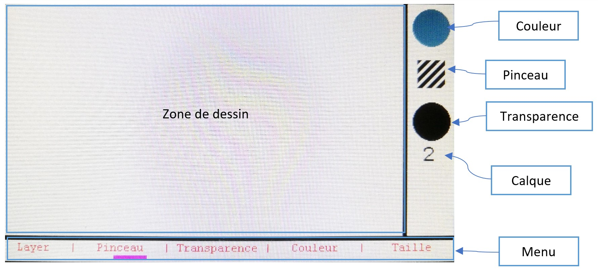
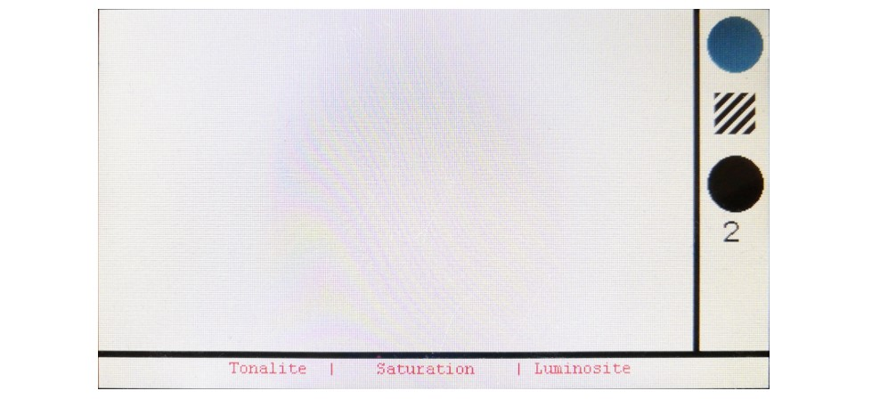
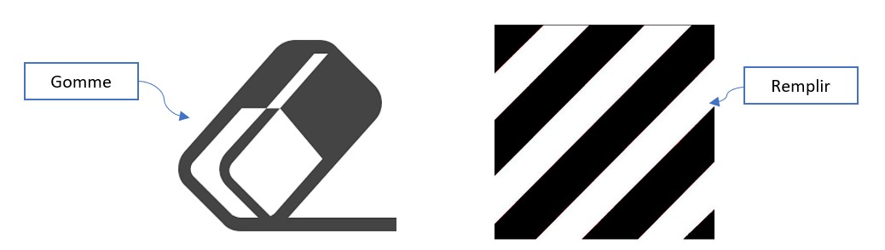

# Guide d'utilisation partie dessin

## Set Up
Pour pouvoir utiliser la partie dessin lancer STM32CubeIDE et ouvrez le projet contenu dans le dossier paint, compiler et envoyer ensuite le programme à la carte. Une fois ceci effectué vous pouvez commencer à utiliser la carte.

## Dessiner sur la carte
Pour dessiner sur la carte utiliser l'écran tactile sur la zone de dessin (en haut à gauche). Le menu pour rêgler les différents paramêtres se trouve en bas. Enfin, on trouve à droite les indicateur des options sélectionné, soit de haut en bas :

+ Couleur sélectionnée
+ Type de pinceau
+ valeur de la transparence (noir signifie opaque et blanc transparent)
+ calque sélectionné (1 ou 2)

### Naviguer dans les menus
Le choix du premier menu se fait avec le joystick pour ne pas ouvrir un menu sans le vouloir en dépassant de la zone de dessin. Ainsi pour choisir un menu on vas à gauche ou à droite avec le joystick se qui fait se déplacer l'indicateur de sélection (violet), puis on entre dans le menu sélectionner avec un clique joystick. A partir d'ici la navigation se fait tactilement.

###### Choix du calque
Le menu calque donne le choix entre deux calque, le calque 1 est le calque du bas et el 2 celui du haut.

###### Choix du pinceau
Le menu pinceau permet de choisir le pinceau suivant ou précédent avec les flêches sur l'écran et de sortir de se menu avec le bouton validé au centre. Pour plus d'information concernant les logo associé à chaques pinceau voir : [Le guide des pinceaux](/STM32_Paint/use/#guide-des-pinceaux)

###### Choix de la transparence
Le menu transparence permet de choisir l'alpha entre 0 et 255, pour choisir la transparence glisser son doigt sur la barre dégradé, le blanc correspnd à une transparence totale et le noir à une opacité complête. Tant que le doigt est maintenu sur l'écran on peut changer la transparence et suivre notre choix en direct dans la partie droite de l'écran, lors du relachement du doigt la transparence sélectionné est la dernière position du doigt.

###### Choix de la couleur

Pour choisir la couleur il y a 3 paramêtres à configurer :

+ La tonalité
+ La saturation
+ La luminosité

Rentrer dans ce menu permet d'en configurer un au choix. Comme sur l'image si dessous :

Ensuite il y aura un dégradé pour choisir la valeur du paramêtre le processus de sélection est le même que pour la transparence, et on peut toujours suivre en temps réel la valeur de notre sélection dans la partie droite de l'écran.

###### Choix de rayon 
Le menu rayon permet de sélectionner le rayon du pinceau de la même façon que pour la transparence il suffit de glisser son doigt pour faire la sélection.

### Guide des pinceaux

Il y a 6 pinceaux possibles :

+ Un rond simple
+ Un remplissage de la zone de dessin
+ Un rond dégradé
+ Un oval horizontal et vertical
+ Une gomme

### Tout effacer
Pour effacer l'ensemble de la zone de dessin il suffit de cliquer sur le bouton BP2.

